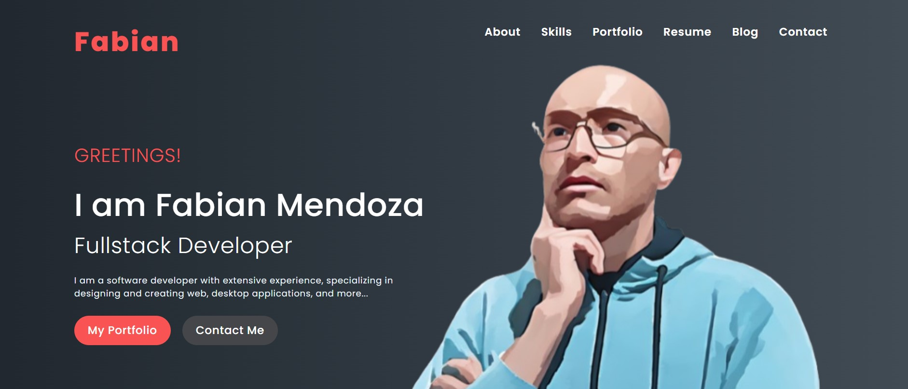

# Fabian Mendoza Portfolio


<br>
[My portfolio](https://fabianmendozaospina.github.io/fabian-mendoza-portfolio/) is a learning project crafted with `HTML5` and `CSS3`, showcasing essential web design principles. Adhering to best coding practices, the project is set to evolve with the addition of `JavaScript` (ES6) to enhance interactivity and functionality. It aims to highlight a clean structure, responsive design, and adherence to modern web standards, making it a solid foundation for future development.

## Features

This website is a testament to modern web development techniques, seamlessly blending aesthetic appeal with functional responsiveness. Crafted with HTML5 and CSS3, it emphasizes not just clean and accessible code but also a flexible design that effortlessly adapts to any device. Here are some standout features that bring this vision to life:

- Semantic HTML: Utilizes meaningful tags for improved structure and enhanced accessibility, ensuring a better experience for all users.
- Hero Banner: Captivating visuals that draw users in and set the tone for engaging interactions.
- Responsive Design: Achieved through innovative layout techniques:
    - Flexbox: A powerful one-dimensional layout system that effortlessly aligns items in either rows or columns.
    - Media Queries: <span style="color: red;">This functionality is under construction</span> 🚧. Soon, adaptive CSS rules that transform the design based on device specifications will be incorporated, providing an optimal viewing experience across all screen sizes.

## Get Started

To get started locally:

1. Clone this repo:
   ```bash
   git clone https://github.com/fabianmendozaospina/fabian-mendoza-portfolio.git
   cd fabian-mendoza-portfolio
   ```
1. Explore the different files.
1. Select the index.html file.
1. Do right-click and select the `Reveal in File Explorer` menu.
1. Double-click on file index.html.
1. The browser will show the starting web page:

   

7. Through the top menu, you can navegate to the other web pages, such as `About` and `Contact`:

   

   


